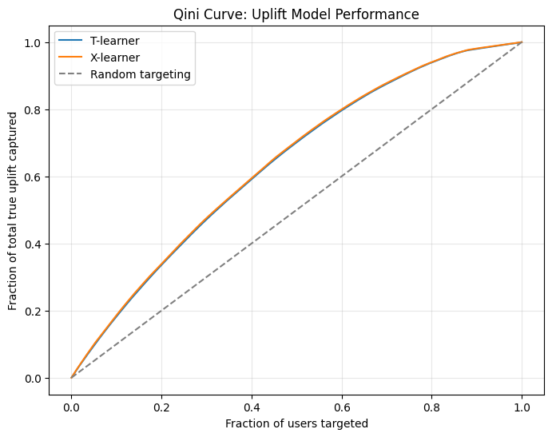

# Causal Uplift Modeling for OTT User Retention

**Problem:** Standard churn prediction tells you *who* is likely to cancel — but not *who an intervention would actually help*. Targeting everyone flagged as "at risk" wastes budget on users who'd stay anyway, or leave regardless. This project builds a model that estimates the **causal effect** of a retention intervention per user, so targeting can focus on the people an offer would actually change the mind of.

## Why this matters (the core idea)

A churn model answers: *"Will this user churn?"*
An uplift model answers: *"Would intervening actually change this user's outcome?"*

Users fall into groups a churn model can't distinguish:
- **Sure things** — will stay regardless of any offer (wasted spend)
- **Lost causes** — will churn regardless of any offer (wasted spend)
- **Persuadables** — will only stay *if* they receive the intervention (the group actually worth targeting)

This project builds and evaluates models that identify that third group.

## Data

[KKBox Churn Prediction Challenge](https://www.kaggle.com/c/kkbox-churn-prediction-challenge) (WSDM Cup, Kaggle) — real anonymized subscription, transaction, and membership data from KKBox, an Asia-based music/media streaming platform.

Data is not included in this repo (large files, Kaggle's terms). To reproduce: download via Kaggle API — see `notebooks/uplift_modeling_project.ipynb` Level 1 for setup instructions.

## Approach

1. **Behavior/value feature engineering** — aggregate raw transaction and membership logs into per-user features: spend, recency, tenure, auto-renew status, cancellation history.
2. **Baseline churn classifier** (Random Forest) — establishes strong predictive performance (ROC-AUC 0.96) but is shown to be fundamentally unable to identify *who an intervention would help*, motivating the causal approach.
3. **Synthetic intervention** — since no real experiment data exists publicly, a synthetic retention intervention is simulated on top of real user features, with a designed (and hidden-from-the-model) true treatment effect, following standard practice for validating causal ML methods offline.
4. **Uplift modeling** — T-learner and X-learner (via [EconML](https://github.com/py-why/EconML)) trained to estimate individual treatment effects from features, treatment assignment, and outcomes only — never given the true effect during training.
5. **Evaluation** — predictions checked against the held-out true treatment effects using Spearman rank correlation and Qini curves, the standard evaluation method in uplift modeling literature.

## Results

- **Rank correlation with true effect:** T-learner 0.96, X-learner 0.98 (Spearman)
- **Qini curve:** targeting the top 20% of users by predicted uplift captures ~35% of total achievable retention benefit, vs. ~20% for random targeting
- X-learner shows a modest but consistent edge over T-learner, consistent with theory



## What I'd extend with more time

- Causal forests for more flexible, non-parametric effect estimation
- Sensitivity analysis on the synthetic treatment effect design
- Incorporating `user_logs.csv` (daily activity) for richer sequential/engagement features
- A/B test design proposal for validating this against a real intervention

## Tech stack

Python, pandas, scikit-learn, EconML, matplotlib — entirely free/open-source, run on Google Colab.

## Repo structure

```
notebooks/
  uplift_modeling_project.ipynb   # full end-to-end notebook
qini_curve.png                     # key evaluation visual
README.md
```
